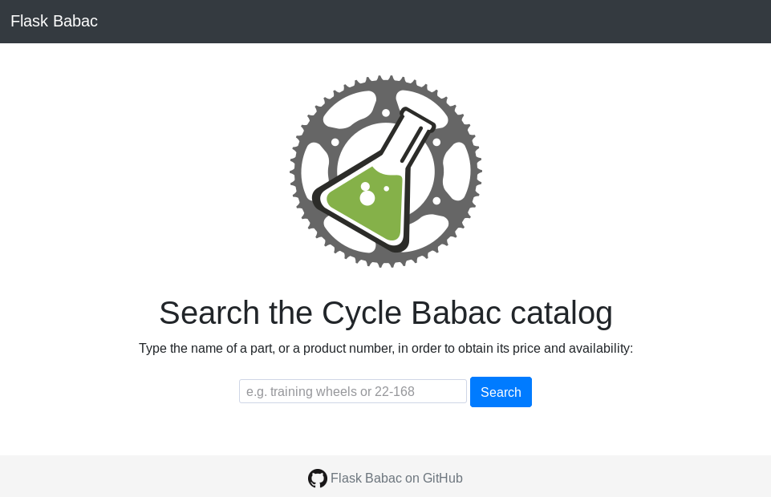
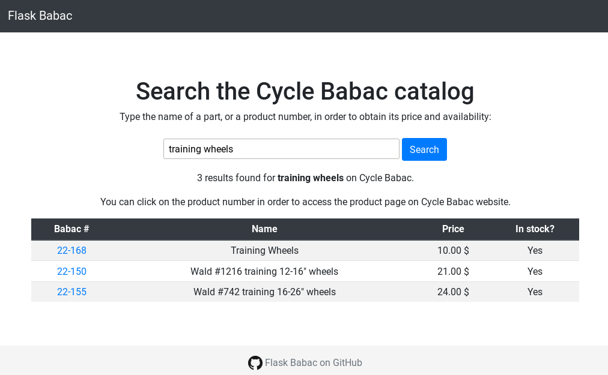

[](https://github.com/psf/black)

# Flask Babac

A Python3 Flask front-end application to search the Cycle Babac catalogue and return description, price and availability.


## Installation

1. Clone the repository

```bash
git clone https://github.com/normcyr/flask_babac
```

2. Create a Python virtual environment using `virtualenv`

```bash
cd flask_babac
virtualenv -p python3 venv
source venv/bin/activate
```

3. Install the module

```bash
pip install -e .
```


## Configuration

1. Connection to the Cycle Babac website

```bash
cp config.yml.example config.yml
```

Then edit the `config.yml` file (*eg* `nano config.yml`) and change the value of the `username` and `password` variables to the proper credentials to log in to the Cycle Babac website.

Finally, move the `config.yml` file to your user configuration folder

```bash
mkdir -p ~/.config/flask_babac
mv config.yml ~/.config/flask_babac/config.yml
```

2. Environment variables for the Flask application

```bash
cp .env.example .env
```

Then edit the `.env` file (*eg* `nano .env`) and change the values of the variables to your desired parameters.


3. Launch the Flask application

```bash
flask run
```

Then access web application at the address given, typically
[`http://127.0.0.1:8080`](http://127.0.0.1:8080)

This is the page you should get at first:



And after search for `training wheels`, you get your results in a table:




## Perform a search on a command line interface

Launch the search with the following command:

```bash
flask_babac search text
```

For example:

```bash
flask_babac training wheels
```

or, using a catalogue number:

```bash
flask_babac 22-150
```
